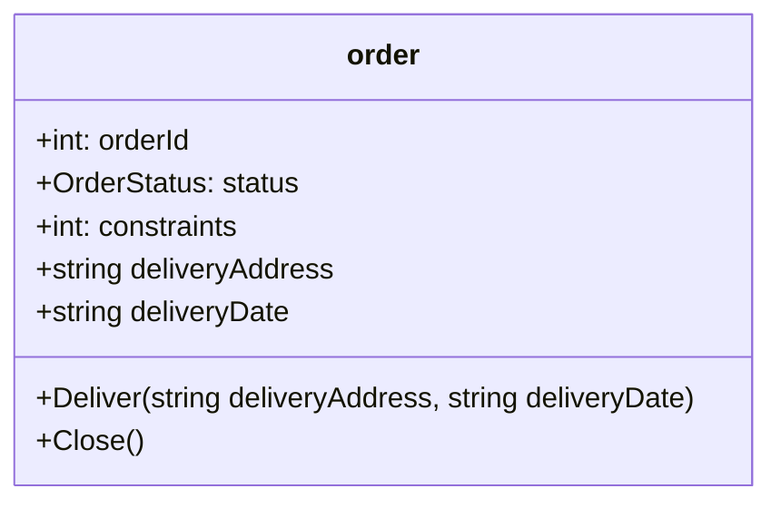
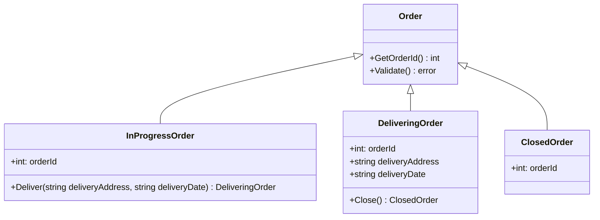

# immutable data model example 
in golang

Ref
https://github.com/kawasima/immutable-datamodel-example

https://gihyo.jp/magazine/wdpress/archive/2022/vol130

# Complex Pattern

```mermaid
classDiagram
class order {
    +int: orderId
    +OrderStatus: status
    +int: constraints
    +string deliveryAddress
    +string deliveryDate
    +Deliver(string deliveryAddress, string deliveryDate)
    +Close()
}

```

# Simple Pattern

```mermaid
classDiagram
Order<|--InProgressOrder
Order<|--DeliveringOrder
Order<|--ClosedOrder

class Order~Interface~ {
    +GetOrderId() int
    +Validate() error
}

class InProgressOrder {
    +int: orderId
    +Deliver(string deliveryAddress, string deliveryDate) DeliveringOrder
}

class DeliveringOrder {
    +int: orderId
    +string deliveryAddress
    +string deliveryDate
    +Close() ClosedOrder
}

class ClosedOrder {
    +int: orderId
    
}


```